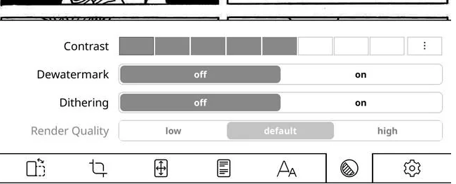
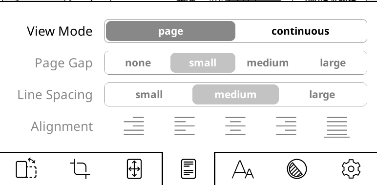
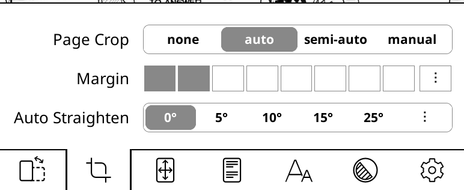
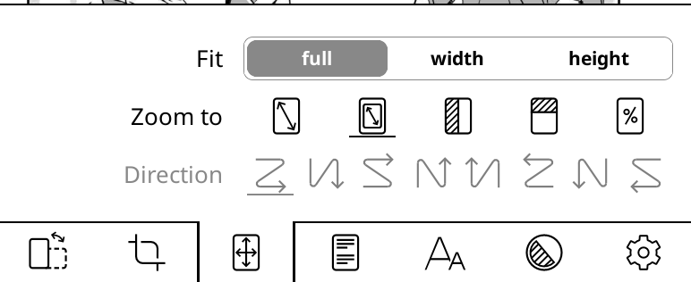

# Reader recommended settings

While not required, you can change some settings on KOReader's reader for a better manga reading experience.

For all of the following settings, tap-and-holding on them will make it the default for the current file type (we store the downloaded chapters in `.cbz` files, so any settings applied to `.cbz` files will also work on chapters read through rakuyomi).

## Enable dithering

In the bottom menu, go to the next-to-last submenu, and then set **Dithering** to "on". This might also fix washed out colors on e-ink devices that support them.

## Use the "page" view mode and enable automatic page cropping

Also in the bottom menu, go to the fourth submenu and set the **View Mode** to "page"; then go to the second submenu and set **Page Crop** to "auto".

## Fit the entire page on the scren

Go to the third submenu on the bottom menu, then set **Fit** to "full". This will resize the pages so that they fit completely inside your screen. 

