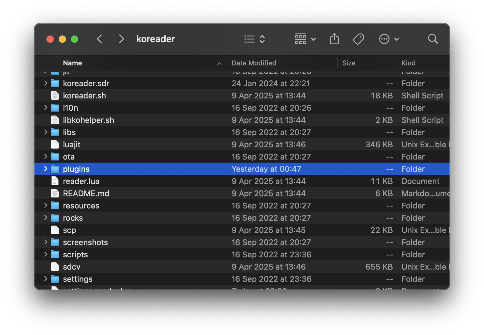
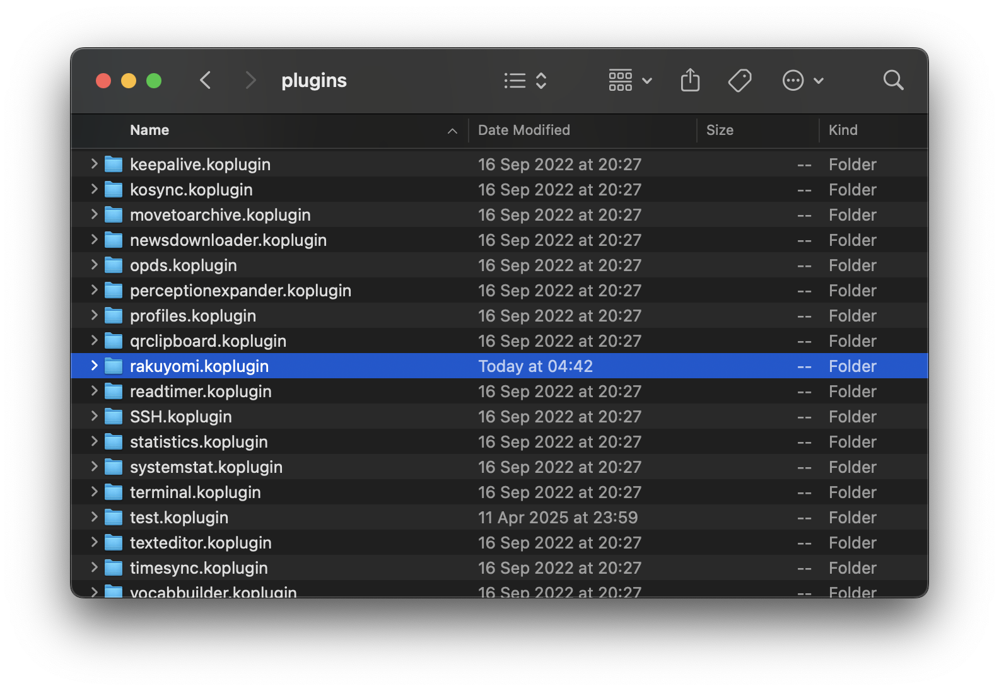
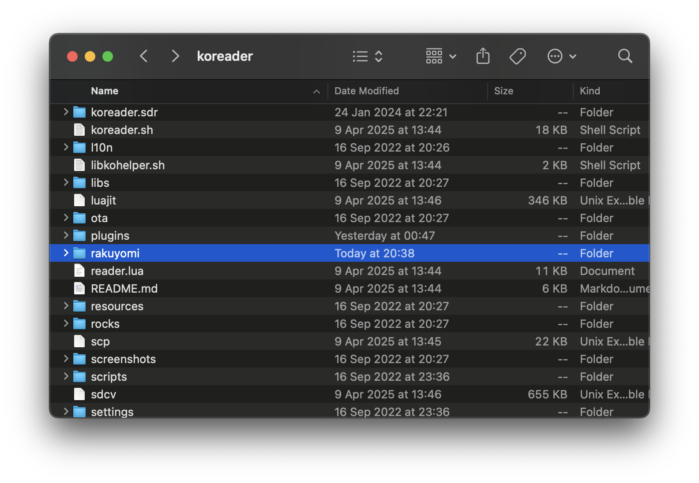
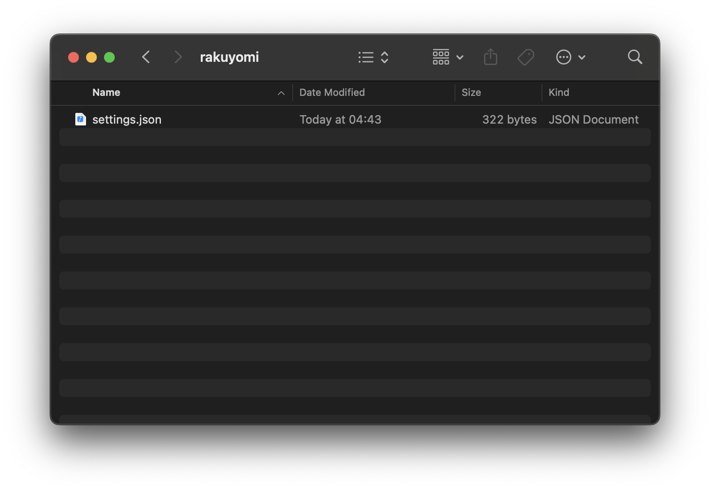

# Installing to Your Device

After downloading the plugin, follow these instructions to install it on your device.

## Writing Your `settings.json`

The `settings.json` file contains basic settings that rakuyomi needs to work, including:
- **Source lists**: URLs containing information about available sources
- **Languages**: Your preferred reading languages

Here's a recommended starter configuration that you can customize or use as-is:

```json,downloadable:settings.json
{
  "$schema": "https://github.com/hanatsumi/rakuyomi/releases/download/main/settings.schema.json",
  "source_lists": [
    "https://raw.githubusercontent.com/Skittyblock/aidoku-community-sources/refs/heads/gh-pages/index.min.json"
  ],
  "languages": ["en"]
}
```

## Copying the Plugin to Your Device

1. Extract the `.zip` file containing the plugin. You should find a `rakuyomi.koplugin` folder inside.
2. Connect your e-reader to your computer.
3. Navigate to your KOReader installation folder. Common locations include:
   - **Cervantes:** `/mnt/private/koreader`
   - **Kindle:** `koreader/`
   - **Kobo:** `.adds/koreader/`
   - **PocketBook:** `applications/koreader/`

4. Locate the `plugins` folder:


5. Copy the entire `rakuyomi.koplugin` folder into the `plugins` folder:


6. Return to the KOReader folder and create a new `rakuyomi` folder:


7. Copy your `settings.json` file into the new `rakuyomi` folder:


rakuyomi is now installed on your device!