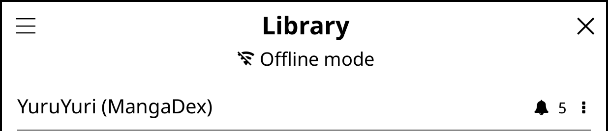
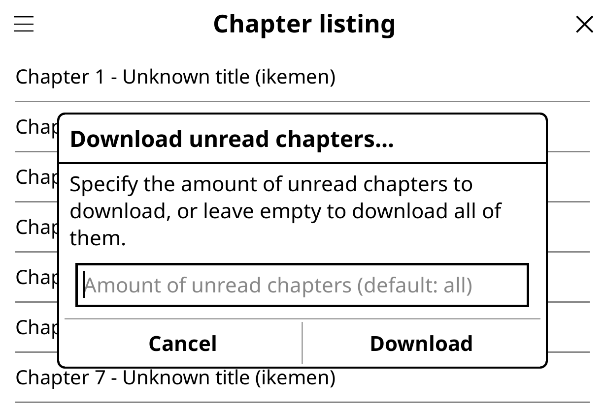

# Offline Mode

rakuyomi is designed to work both online and offline, allowing you to read manga even when you don't have an internet connection. This guide explains how offline mode works and how to make the most of it.

## How Offline Mode Works

When you don't have an internet connection, rakuyomi automatically enters offline mode. You'll know you're in offline mode when you see this indicator at the top of the screen.

In offline mode:
- **You can read any previously downloaded chapters**
- **Your library content will remain accessible**
- **Features requiring internet connectivity will be limited**

## Preparing for Offline Use

To make the best use of offline mode, you should download chapters when you have an internet connection. The quickest way to prepare for offline reading is by using the **download unread chapters** tool:

### Downloading Unread Chapters

To download multiple unread chapters at once:
1. Open a manga from your library
2. Tap the menu button (<i class="fa fa-bars"></i>) at the top-left
3. Select "Download unread chapters..."
4. Enter the number of unread chapters to download, or leave blank to download all unread chapters
5. Tap "Download"

A progress dialog will show the download status. You can cancel the download at any time.

## Storage Management

rakuyomi stores downloaded chapters as `.cbz` files in the `downloads` folder within the rakuyomi directory. When the storage limit is reached, older downloaded chapters will be automatically removed to make space for new downloads.

You can configure the storage size limit by opening the menu in **Library**, then going to **Settings**. The default storage limit is 2GB.
