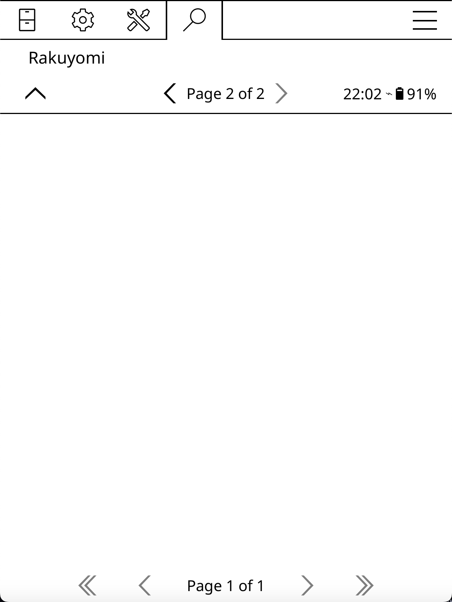
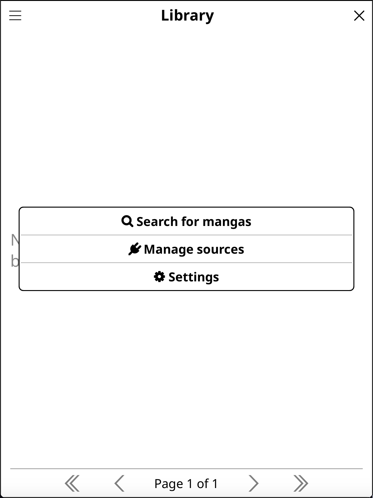
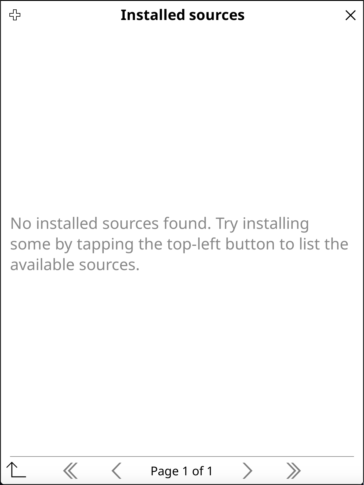
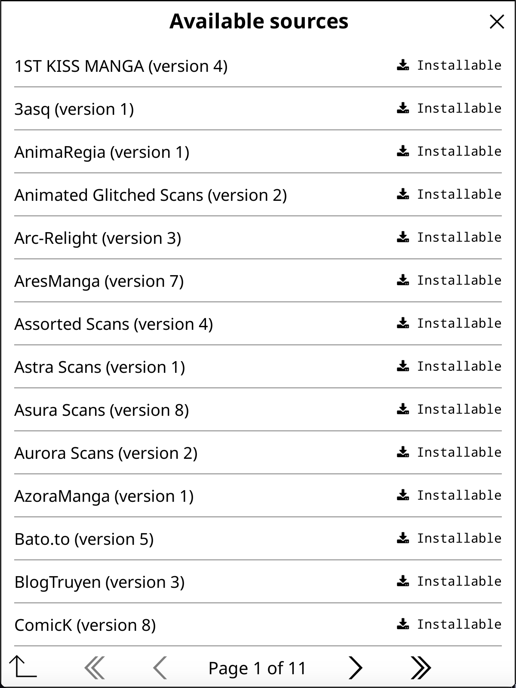
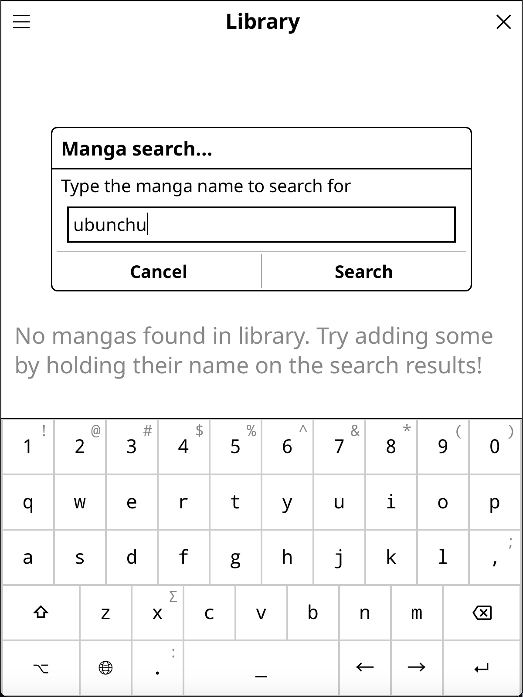
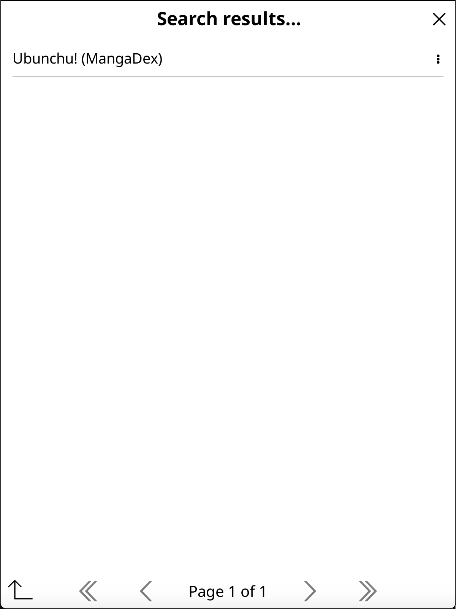
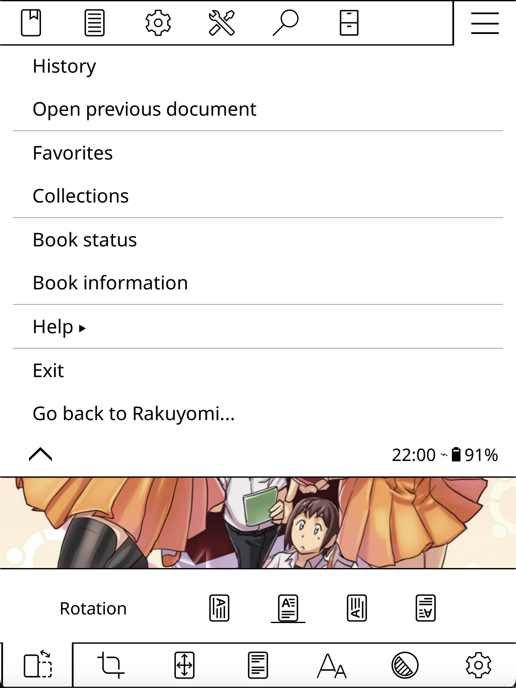

# Quickstart

Here's a quick guide to rakuyomi's core functionality. After installing, tap on the top section of the screen while in the File Manager to bring up the menu bar. Go to the <i class="fa fa-search"></i> menu and select Rakuyomi:

<div style="text-align: center">
    
</div>

You'll see rakuyomi's **Library**, which should be empty at first. Let's install some sources to get started. Tap the <i class="fa fa-bars"></i> button on the top-left to bring up the menu, and select **Manage Sources**:

<div style="text-align: center">
    
</div>

You'll now see a list of **Installed Sources** (which will be empty initially). Tap the <i class="fa fa-plus"></i> button in the top-left to install new sources. Simply tap on any source in the list to install it!

<div style="display: flex; justify-content: center; gap: 10px;">
    
    
</div>

Return to the **Library** by tapping the back button in the bottom left. To search for mangas, open the menu (<i class="fa fa-bars"></i>) and select **Search mangas**:

<div style="text-align: center">
    
</div>

After entering your search terms, you'll see a **list of search results**. Tap on a manga's title to view its available **chapters**, then tap on a specific chapter to begin reading.

<div style="display: flex; justify-content: center; gap: 10px;">
    
    
</div>

```admonish tip
Whenever you see an item with a &nbsp;<i class="fa fa-ellipsis-v"></i>&nbsp; icon to the right, tapping next to it or holding on the item will open a dialog with **additional options**.

For example, tap-and-holding on a manga in the **search results** will prompt you to add it to your **Library** for easier access later.
```

rakuyomi will open the selected chapter in KOReader's reader. To return to rakuyomi at any time, tap on the top section of the screen to bring up the menu bar, go to the <i class="fa fa-bars"></i> menu, and select **Go back to Rakuyomi**.

<div style="display: flex; justify-content: center; gap: 10px;">
    
    
</div>

```admonish tip
After reaching the last page of a chapter, rakuyomi will automatically download and open the next chapter when you attempt to navigate forward. This seamless transition allows you to continue reading without interruption!
```

Congratulations! You're now ready to enjoy manga using rakuyomi. For an enhanced reading experience specifically tailored for manga, check out the [reader's recommended settings](./reader-recommended-settings/) to optimize page navigation, image scaling, and other important display options.
